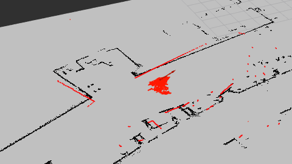
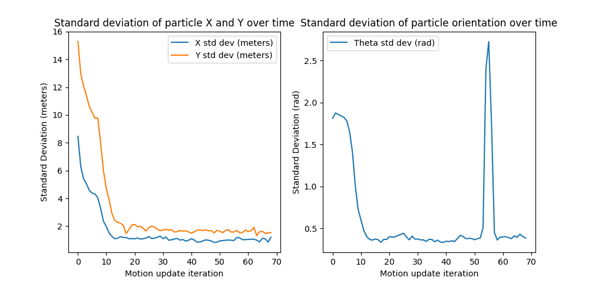
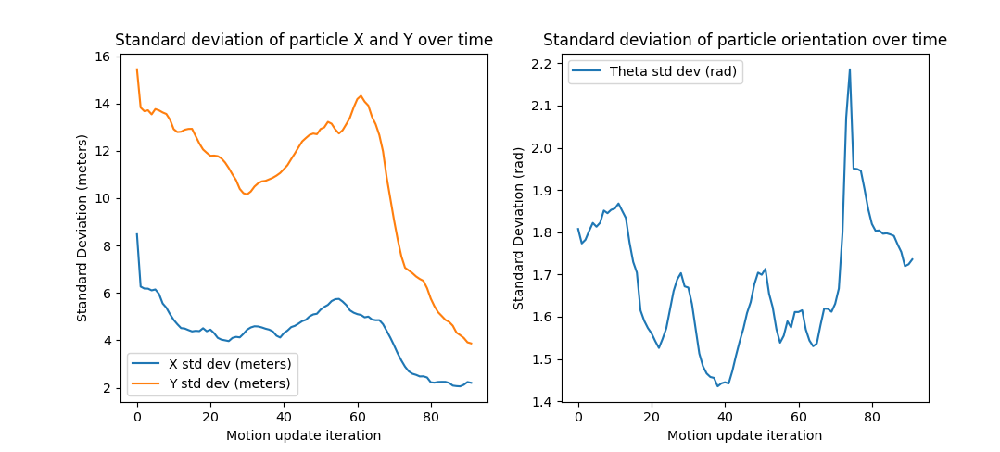
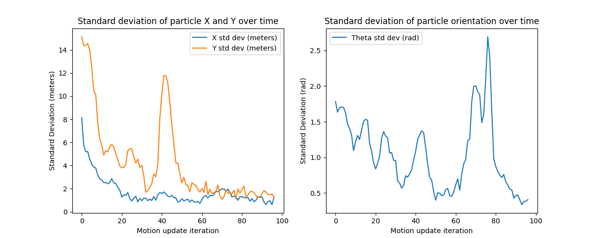

## Particle Filter Implementation
By: Zaraius Bilimoria, Ben Ricket

## Overview
Implementation of a particle filter using LiDAR scan data for a mobile robot, using ROS2 Humble. 

### Running the filter

This project requires a working ROS2 Humble environment. 
After cloning the repository, building with colcon, and souring the `install/` directory, the following commands, run in separate terminals, will launch the particle filter, rosbag recording of the robot movement, and visualizer:

```ros2 launch robot_localization test_pf.py map_yaml:=src/robot_localization/maps/mac_1st_floor_final.yaml```

```rviz2 -d ~/ros2_ws/src/robot_localization/rviz/turtlebot_bag_files.rviz```

```ros2 bag play src/robot_localization/bags/macfirst_floor_take_2/macfirst_floor_take_2_0.db3 --clock```

Optionally, another executable can be run in order to display the convergence of the algorithm visually. This node can be run with: 

```ros2 launch robot_localization mpl_vis.py ```

There are two bag files inside of the `/bags` folder. We ran our particle filter on the input sensor data and recorded the output. They correspond to the two takes of the input data, particle-filter-take-1 is the output of running our particle filter on macfirst_floor_take_1 and particle-filter-take-2 is the output of macfirst_floor_take_2. The following topics are being recorded: `/accel /odom /cmd_vel /tf /tf_static /base_footprint /map /scan /particle_cloud`
The `/odom` topic is the frame static relative to the map, initialized at the robot's initial position. After every pose estimate update for the robot (calculated from a weighted average of our particle cloud, whose topic is `/particle_cloud`) we update the transform between the map and odom frames in order to ensure the robot's current location in the odom frame aligns with its current position in the map frame; i.e., that our robot's odometry frame position and map frame position correspond to the same physical location.

### Project Goal

The goal of our project was to implement the core functionality of a particle filter, an algorithm for robot localization within a known map. The particle filter works by making a large number of initial guesses for the current robot pose, where each pose estimate is referred to as a particle. After the robot moves a meaningful distance, the filter uses the sensor data from the robot (in our case, a lidar scan) in order to weigh each particle based on how correct it seems. If the scan data closely aligns with what it hypothetically would be given the particle is a correct guess, the filter gives more weight to the particle; otherwise, the filter gives less weight to that particle. After weighing the particles, the filter normalizes the weights such that they sum to one (i.e., define a valid probability distribution) and chooses another set of particles from the initial particles, drawn with each particle's weight giving the probability of selecting it. To explore the entire state of possible estimates, we add noise to each new particle, normally distributed in each dimension, allowing guesses to shift and become more refined with time. 

The actual pose estimate of the robot is calculated as a weighted sum of the particle positions, where the contribution of each particle is proportional to its weight. This becomes weaker in the case of a bimodal or multimodal distribution, where clusters of particles may converge to near-equally valued guesses, but the mean is still simple to implement and valid for situations where the algorithm converges. 

One downside of the algorithm is the tendency for particles to converge to local optima that may be far away from a global optimum, especially if the map has symmetry to it. To avoid this, we add a small number of particles uniformly sampled from the space of all possible poses every iteration, ensuring we can escape convergence towards a poor guess. 



We were able to achieve this goal, running our particle filter on a rosbag recording of a robot moving around the first floor of the Academic Center, given an occupancy grid of the map. The filter was able to converge to a reasonably accurate pose estimate, measured by both the convergence of the algorithm as well as the agreement between the robot laser scan data and the map obstacles and walls. 

### Implementation / Solution

Our particle filter implementation consists of a particle initialization phase (as well as initialization/setup of the occupancy grid and other utilities) followed by a main run loop. The main body of the run loop only updates after the robot has moved greater than a specified threshold; this is to ensure new information is available to use in localization. The order goes as follows:


- Initialization: Create utilities and class attributes (Occupancy grid for given map, ROS2 publishers, subscribers, etc). The first time we run the loop, we also create our particle cloud, consisting of an array of `Particle` objects with an x and y location and an orientation theta. Initially, these are smapled from a uniform distribution over our entire map space, and particles inside of obstacles are resampled until they fall in valid locations.  
- Check distance moved against move threshold: use the provided `TFHelper` object to get the current pose and calculate the new pose. If the new pose indicates that the robot has moved a distance greater than the movement or rotation threshold, there is enough information available to update the particles. Otherwise, restart the loop --- we don't want to update the particles if our information isn't significantly different from what we had before.
- Update particle positions: we can take the difference between the current robot pose (from odometry data) and the previously used pose in order to get a change in position over the last particle update iteration. Our particles should therefore move in the same way, so we transform the location of each particle as if the same movement measured from the odometry data had been performed by every particle. This occurs primarily in the `update_particles_with_odom()` function.
- Update particle weights: The most recent laser scan measurement (on the `/scan` topic) is transformed into the robot base link frame, which moves with the robot, and consists of values of r (radius to nearest object for each beam) and theta (angle of each beam in rad, with zero pointing in the same direction as the robot). Our current implementation in `update_particles_with_laser_projection()` takes a random subset of these individual laser scan beams, ensures the entries in the corresponding locations in r are within the minimum and maximum distance of the sensor, and projects them onto the map frame relative to each particle --- i.e., the x position of the *i*th endpoint for a given particle `p` is equal to `p.x + r[i] * cos(p.theta + theta[i])`, and the y position would be `p.y + r[i] * sin(p.theta + theta[i])`. As the laser scan ends at obstacles (at distance 0 from obstacles,) we query the occupancy grid's `get_closest_obstacle_distance()` function to get the distance from the nearest obstacle at each sampled point. The greater the value is from zero, the greater our error. As a simple way of weighing particles, we take these differences as our errors, sum the error across all samples for every particle, add a small value to ensure our error is nonzero, and then take the reciprocal of this value to get a non-normalized weight, where a greater value indicates the particle aligns more with the laser scan data. 
- Update robot pose: We calculate the pose of our robot as the weighted average of our particle pose estimates. In other words, we sum the x, y, and theta for every particle, scaling each component by the particle's weight. Dividing by the sum of the weights yields weighted averages for x, y, and theta, which we use as our current pose estimate. This is passed to a function `fix_map_to_odom_transform`, which updates the static transform between the map and odom frames in order for the robot's current pose given odometry to align with the predicted pose on the map. This is visually noticed in Rviz2 when the laser scan points shift relative to the map, as correcting the map-odom transform also corrects the map-base_link transform, allowing the laser scan points to be visualized in their proper location.
- Normalize particle weights: Before resampling particles, we want the weights of the particles to sum to 1 --- this ensures that the weights of the particles define a valid probability density function, which can be passed to a random choice function in order to select new particles from existing particles according to their weight. Normalization is achieved by dividing each particle weight by the sum of all weights. We also save the total weight value as a "score" to use in logging and visualization, though this does not affect the algorithm.
- Resample particles: To resample our particles, we define a proportion of particles to sample from existing ones (for instance, 99%) and take the remaining proportion of particles to be sampled from a uniform distribution. The uniformly distributed particles are sampled the same way as in the initialization step, while the resampled particles are sampled by passing a list of particle positions and corresponding list of normalized particle weights to the `draw_random_sample()` helper function, which draws samples from our current list of particles with replacement, with probabilities equal to the normalized weights. To allow our particles to shift and move with time, we also add independent and normally distributed noise to each of the x, y, and theta parameters of the new particles, with standard deviations defined and means of zero. If this noise results in particles out of bounds or inside obstacles, we throw them away, trusting enough particles will be valid for the current iteration to still be useful. We then return to the start of the loop with our new set of generated particles, iterating continuously. 

### Design Decisions

#### Random Uniform particles

To prevent particles from too quickly converging on a local optimum, we chose to keep a small proportion of the particles uniformly generated within the entire map space every iteration. This ensures that even if all the particles converge on a local optimum far from a global one, there is still a fairly common chance for random particles to escape and find a better location overall. In order to control this, we implement an attribute of the particle filter, `proportion_random`, which describes what percent of the particles should be drawn from a random uniform distribution across the space, with the rest taken from resampling the existing particles plus the addition of Gaussian noise.

#### Particle Weight function

At first, we weren’t adding any noise to our particles and were moving them directly with the robot pose. This isn’t realistic because odometry from wheel encoders always has error due to slippage, uneven flooring, or drift. To model this uncertainty, we update each particle using the odometry delta (the estimated change in pose) and add Gaussian noise to both the translation and rotation. We approximate each motion as a rotation–translation–rotation sequence, which captures typical differential-drive motion and lets us apply noise separately to linear and angular components. It’s also important to apply this noise in the particle’s local frame, since odometry error occurs relative to the robot’s heading. Adding noise this way keeps the particle cloud spread out, allowing for more realistic pose hypotheses and preventing all particles from drifting together when the robot’s odometry is inaccurate.

To get the weight of each particle, we initially calculated an error by comparing the closest obstacle distance from the Neato’s laser scan with the closest obstacle distance predicted by each particle’s pose. Our first weighting function was simply 1 / error, where the error was the absolute difference between these two distances. However, we found that this approach was unstable and highly sensitive to small errors, since the weight would blow up as the error approached zero, and it didn’t reflect how real sensor noise behaves.

We initially improved our particle weighting function by replacing the reciprocal relationship with a Gaussian-based probability model:
```p.w = math.exp(-0.5 * (p_distance ** 2) / (self.sigma ** 2)) + self.eps```
The function doesn't give as much weight to very-small distances as a simple 1/x function does, and the epsilon value helps avoid divide by zero when dividing by normalized particle weights.

This equation models the likelihood that a given particle’s predicted scan matches the observed scan under a normal distribution of sensor noise. Particles with smaller errors get exponentially higher weights, but not infinitely large ones. The constant σ controls how sharply the weights fall off — effectively tuning how confident we are in the laser scan measurements — and ε ensures no particle gets exactly zero weight, maintaining diversity in the resampling step.

#### Particle weight using laser scan endpoints

We later also moved from using only the closest beam to incorporating multiple laser beams, which provides more spatial information and allows particles to be evaluated based on a richer representation of the scan. This significantly improved convergence, particularly for orientation, since angular errors are more directly reflected when using multiple beams. To control this, we set the number of beam endpoints to use per particle, as a relatively small number of beam endpoints (approximately 20) gives much more accurate angular convergence while being multiple times faster than using all laser scan endpoints, of which there are a few hundred.

This is implemented by computing the grid cells at which laser scan endpoints would fall given a laser scan originating at each particle's position and orientation, which more directly encodes orientation information. 

In implementing this, we also returned to a very simple weighting function, summing the differences between zero (the expected distance to obstacle at each laser scan endpoint) and the actual distance as our errors, adding a small epsilon value to avoid dividing by zero, and taking the reciprocal in order to get weights. Using a different function for translating distances to weight may make convergence easier, but we observed relatively good results with this current setup and didn't experiment with other choices for this method of calculating error.

#### Convergence logging and visualization

We decided that measuring the performance of our particle implementation would be difficult when judging subjectively by eye --- it's possible to tell when a filter is clearly not performing well, or when it appears to converge, but quantifying this degree of convergence is more difficult. To do this, we defined and implemented a function `calculate_convergence()`, called once per particle update, which calculates the mean and standard deviation of the particle scores (non-normalized weights) as well as the standard deviations of the particle poses, appending these to a list to each be published to a topic.

We then created a small node to run concurrently with the particle filter, which subscribes to the convergence logging topics and displays the convergence of the algorithm by plotting the standard deviations of particle positions over time using Matplotlib. The node can be run by running the executable `mpl_vis.py` while the particle filter is running. This let us validate, with some degree of detail, the performance of different tuning parameters and approaches. 

For instance, this plot displays the convergence of particle X coordinate, Y coordinate, and orientation over the different iterations given 5000 particles and a weighing function using projected laser endpoints. The large spike in orientation standard deviation occurs during a sharp turn in the robot movement, with the orientation of some of the particles lagging behind for a short amount of time.



This converged much better than the run without laser endpoints, which simply used minimum distance to an obstacle at every particle's position for its weight. While this run had position converge to some rough extent, using only the particle position makes the orientation of each particle only indirectly related to score via the motion update; it's therefore unsurprising to see that orientation converges much less than in the better simulation above:



Similarly, we observed the effect decreasing the number of particles has on the convergence and stability --- running with a tenth as many particles, 500, we observed similar standard deviations in the best case --- approximately 2 meters for physical position, and 0.5 radians for angle. However, this run was much less stable and frequently drifted from this value:



If we had more time, we could adjust the exact data that makes sense to plot, automatically measure the convergence based on this data, and run a parameter sweep or optimization across our different parameters (number of particles, proportion of particles to draw uniformly random, standard deviations of noise added at different points, reward/cost function, and number of laser scan endpoints to use per particle per iteration), but for the short term, this let us observe that our code was functioning and the improvements were actually present.

### Challenges

One initial confusion we had was with the method of resampling particles. We were initially concerned that simple moving each particle and choosing some more than others based on weight would not be ideal, as more particles in a less optimal area would be favored over fewer particles in a more optimal area; however, we now realize that so long as a particle is higher weighted than the average particle, it will be sampled equally or more in the next iteration, and will eventually dominate with time. We made this change after first observing the infeasibility of our first method, which was enumerating tuples of coordinates and linearly interpolating the particle weights. Not only would the interpolation make convergence difficult, but enumerating the indices was not at all feasible for the size of our map --- after \(semi-arbitrarily\) choosing to use 360 indices for angle, we calculated that our single list of indices would take over 6GB of RAM, and the interpolation would probably take forever, if we waited enough for it to finish running. 

Our initial implementation of the particle scoring step of the algorithm struggled with convergence despite running quickly, particularly with the angle converging. The simplest way of scoring every particle's location was to use the minimum distance to an obstacle as reported by the laser scan, compare that to the distance to the nearest obstacle at each particle's position, computed by the occupancy grid, and use the difference as an error to invert for weighting. However, angle is only encoded in this metric indirectly, by way of the motion update being dependent on angle, and thus we found our position would converge quickly but our angle would not converge as much.

To fix this, we implemented a more sophisticated method for weighing the particles based on projecting the detected obstacles from the laser scan from every particle into the map frame, using the distance to an obstacle at that point as the error given that every definite laser endpoint should occur at an obstacle. Each particle can then give us much more information, as many pieces as there are valid laser results from the scan, and angle is directly included in calculating the particle weight. We can also choose to use fewer than the max number of laser scan beams if we figure a smaller number of beams gives sufficient information for each particle. 

### Next Steps / Improvements

One feature we didn't implement for our project was any consideration of an initial pose estimate in the robot localization. Currently, we initialize our particles from a completely uniform distribution, without any information we might have over our robot position. While this is useful in some scenarios with limited information, particle filters can also be used for situations where we might have some idea of our initial pose, but we want to refine it or even just track it over time despite sensor and motion noise. Incorporating an initial pose estimate would allow for us to use any initial information we might have in more quickly converging. 

If we had more time, we could spend more time tuning the scoring of particles in a way that would give us more control over what laser scan endpoint discrepancies correspond to what weights. With the naive approach, we just take the reciprocal of each distance to obstacle at every endpoint and sum them together. However, the reciprocal inherently gives much more weight to low errors, and much less to further ones. We could try implementing a reward function / scoring function with more parameters to tune in case we wanted to change the distribution of weight given error. 

We would also like to make certain fixed parameters of our algorithm variable depending on the current state of the particle filter. For instance, we could have an adaptive particle count, where more particles are generated when the particles haven't converged as much, while fewer are generated when it does converge. We could also have the standard deviation of our particle generation noise, or the proportion of our random particles, decrease once our pose estimate converges --- this would be similar to optimization techniques like simulated annealing, where we lower a temperature parameter (our random particle proportions and standard deviations) over time in order to find a good spot to converge initially but hold ourselves tighter to it afterwards. 

Improving or tuning the algorithm would also be made easier using our visual logger plotting convergence data, as we can assume that, typically, better approaches would converge tighter or faster. Doing a parameter sweep and finding which parameters most consistently lead to stable convergence (low standard deviation of particle pose) could help identify which parameters play a key role in helping the algorithm converge, as might quantifying the particle score in a more physically meaningful way. 

### Lessons Learned

One lesson we learned was to be very careful about the relation between physical units of distance (meters, for instance) and the discretized distances representing occupancy grid cell indices. Initially, we assumed almost all results would be in grid cell indices, and were incorrectly calling the occupancy grid distance to obstacle functions because of that. This also led to us making errors in the bounds checking for our particles, as the units we passed the function were not what it expected.

One of our consistent sources of errors throughout the project was behavior caused by simple typos, particularly around boolean checks. For instance, we spent over and hour debugging and trying to improve our particle scoring when in reality we found we were rewarding particles with more error rather than the opposite, and similarly spent a while locating our particles before realizing we were publishing their positions outside of the map, as we hadn't represented them in physical units. Some of these bugs could have been caught more easily had we chosen an easier environment to test in, and so we may have had more luck had we tried a simpler environment (for instance, the Neato gauntlet test world in simulation) rather than the full map of the first floor of the Academic Center. 

This lends itself to another lesson learned --- we should verify the filter works (at least vaguely) on a simple case before trying to optimize. Measuring the performance of different parameters, like the standard deviation of different noise sources or the proportion of particles randomly generated every iteration, was only possible once we had a valid implementation already working. When the filter wasn't working at all, in times like when we had erroneously flipped the particle scoring, tuning these parameters had no visible effect, and served largely as a waste of time in the moment. We might have also tested different components of the filter in isolation --- when we were initially listing every possible tuple of indices, not realizing how unworkably large such a list would be, we didn't test this on our map in isolation, and instead worked through the entire run loop trying to find what was causing our program to hang. 